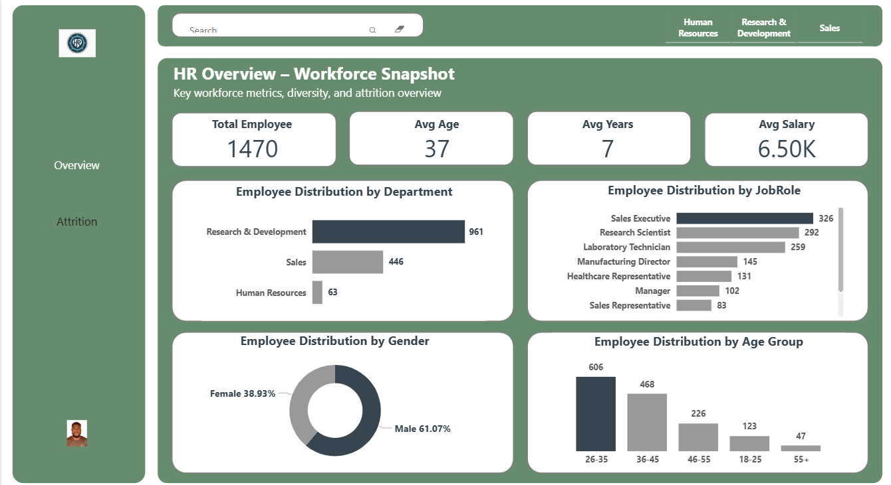
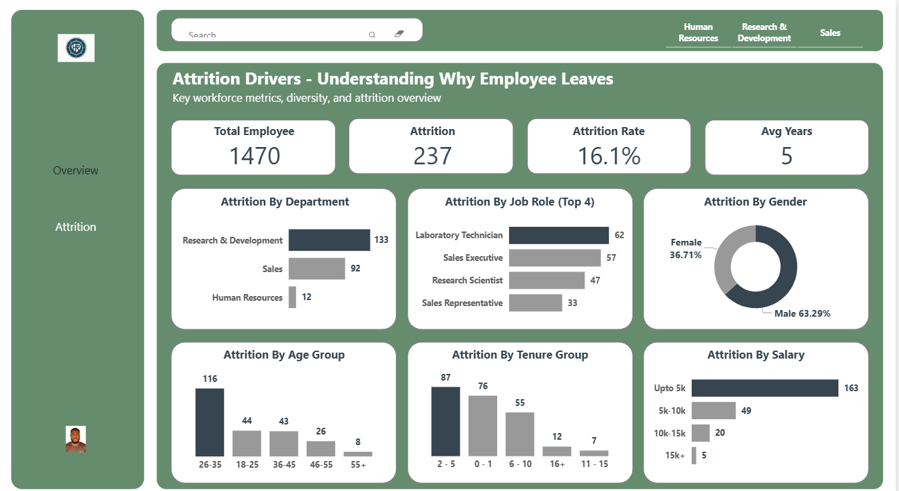

# 📊 HR Analytics Dashboard – Workforce & Attrition Insights

## 🔹 Project Overview
Employee retention and workforce management are critical for business sustainability.  
I developed an **HR Analytics Dashboard in Power BI** to help HR leaders monitor workforce composition, diversity, and attrition drivers.

The dashboard provides:
- A **workforce snapshot** (headcount, demographics, salaries, job roles)  
- An **attrition analysis** (who leaves, when, and why)  

These insights enable HR managers to design **data-driven strategies** for retention, talent acquisition, and employee engagement.

---

## 🔹 Business Problem
- The company had limited visibility into which employees were leaving and why.  
- Leadership needed to understand attrition trends by department, role, tenure, and salary to guide retention policies.  
- Workforce demographics (age, gender, job role distribution) were not being tracked in a way that supported **diversity & inclusion initiatives**.  

---

## 🔹 Data Used
- **Employee Data**: Age, Gender, Department, Job Role, Tenure, Salary.  
- **Attrition Data**: Employees who left, including their demographics, role, and tenure.  

---

## 🔹 Tools & Skills Applied
- **Power BI**: Dashboard design, interactive visuals, slicers.  
- **DAX**: Measures for attrition rate, tenure, average age, salary buckets.    
- **Data Visualization Best Practices**: Executive summaries at the top, detailed breakdowns below, and intuitive color coding.  

---

## 🔹 Dashboard Features

### 📍 Workforce Overview Page
- **Total Employees**: 1,470  
- **Average Age**: 37 years  
- **Average Tenure**: 7 years  
- **Average Salary**: 6.5K  

**Distribution by Department**: R&D (961), Sales (446), HR (63)  
**Distribution by Job Role**: Sales Executives (326), Research Scientists (292), Lab Technicians (259)  
**Gender Distribution**: Male 61%, Female 39%  
**Age Distribution**: Majority between 26–45 years (73%)  

### 📍 Attrition Analysis Page
- **Total Attrition**: 237 employees (16.1% attrition rate)  
- **Average Tenure at Exit**: 5 years  

**Attrition by Department**: R&D (133), Sales (92)  
**Attrition by Job Role**: Lab Technicians (62), Sales Executives (57), Research Scientists (47)  
**Attrition by Age Group**: Highest among 26–35 (116 exits)  
**Attrition by Tenure**: Most employees leave within 2–5 years  
**Attrition by Salary**: Majority (163) earned < 5K → pay as a strong driver  

---

## 🔹 Key Insights & Business Impact
- **Early Career Flight Risk** → Young employees (26–35) with 2–5 years of tenure are leaving the most → career progression challenges.  
- **Critical Roles at Risk** → Lab Technicians, Sales Executives, and Research Scientists face high attrition → core operations risk.  
- **Compensation Gap** → Majority of attrition from employees earning < 5K → salary competitiveness issue.  
- **Departmental Hotspots** → R&D and Sales losing the most employees → need targeted retention.  
- **Diversity Opportunity** → Male-dominated workforce (61%) → room to strengthen gender balance initiatives.  

---

## 🔹 Recommendations
- **Retention Strategy for R&D and Sales**: Role-specific incentives, career development plans, mentorship programs.  
- **Compensation Review**: Reassess pay structure for employees in the < 5K bracket.  
- **Early-Career Engagement**: Fast-track promotions & professional development for 2–5 year employees.  
- **Diversity & Inclusion**: Stronger recruitment and retention policies for female representation.  

---

## 🔹 Final Deliverables
✅ Interactive Power BI Dashboard (Workforce Overview & Attrition Analysis)  
✅ Executive summary for HR leaders highlighting key risks and drivers  
✅ Actionable recommendations for improving retention & engagement  

---

## 🔹 Project Snapshots

### 📸 Workforce Overview Dashboard

### 📸 Attrition Drivers Dashboard
   

